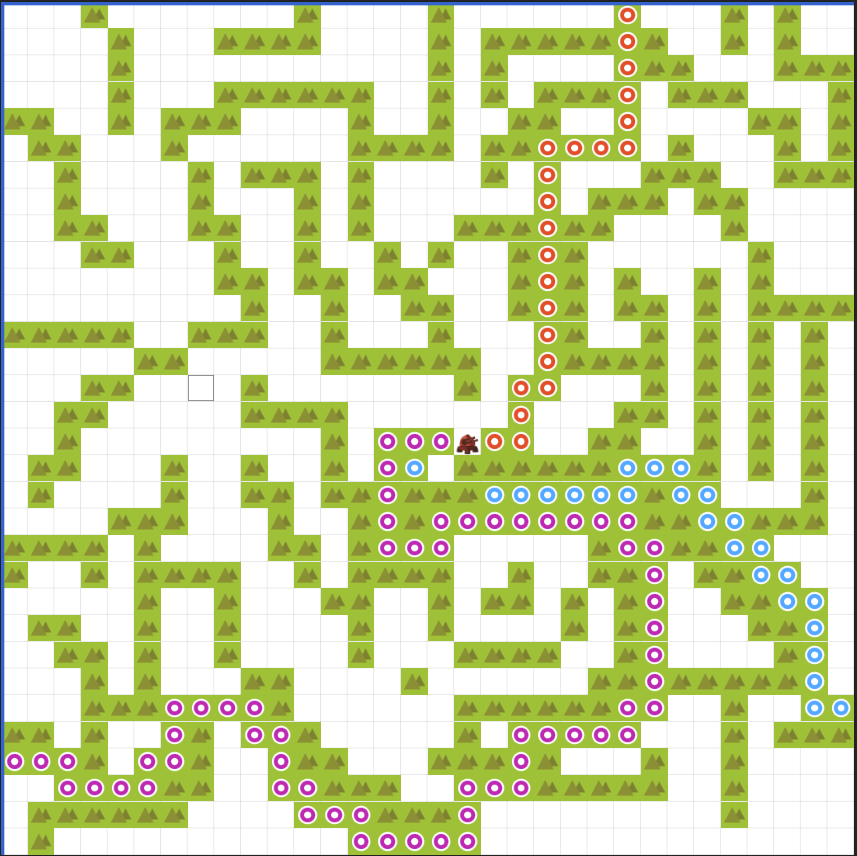

# RTS Pathfinding (Stage 4 – Final Release)

## Overview
This C++ project demonstrates a **grid-based RTS pathfinding system** with:

1. **Manual JSON Parsing**  
   Starts by scaning the JOSN for `layers[0].data` from `single_unit_single_goal_test.json` without external libraries.
2. **A\* Pathfinding**  
   The code finds the shortest path on a 2D grid, treating cells with value `3` as blocked terrain.
3. **Multiple Unit Coordination**  
   Using the `MultiUnitCoordinator`, multiple agents (each identified by special floating-point start values) can navigate to their goals.
4. **JSON Output Generation**  
   Produces a new `output_map.json` that can be loaded in [RiskyLab Tilemap](https://riskylab.com/tilemap/) for visual confirmation.

In **Stage 4**, I’ve added multi-agent pathfinding. Each agent:
- Can be marked by special floating values (`0.5`, `0.6`, `0.9`).
- Searches for goals (`8.1`, `8.4`, `8.13`) and assigns itself to one.
- Uses A* to plan a path, stepping around collisions with other agents.

## Requirements
- **C++17** (e.g., `g++ 14.2.0` or newer).
- A terminal or command prompt for compiling.

## How to Build
1. Ensure your compiler supports C++17.
2. In the project root, compile all sources:
   ```bash
   g++ -std=c++17 -o rts-pathfinding src/main.cpp src/Map.cpp src/JsonParser.cpp src/Pathfinding.cpp src/MultiUnitCoordinator.cpp -I./src
   ```
3. On **Windows**, run `compile.bat`.

## How to Run
After building, run the executable created after compiling. The two arguments after the executable can be provided as input and output JSON locations respectively:
```bash
.\rts-pathfinding.exe .\data\single_unit_single_goal_test.json .\data\output_map.json
```

1. Loads `data/sample_map.json`.
2. Finds agent start cells (`0.5`, `0.6`, `0.9`) and goals (`8.1`, `8.4`, `8.13`).
3. Assigns goals, runs A* per agent, and marks the map if configured.
4. Writes the updated map as `data/output_map.json`.
5. Optionally runs a collision-free step simulation, printing agent states.

## RiskyLab Icons for Starts and Goals
To help visualize in **RiskyLab**, you can assign custom icons to specific cell values:
- **Starts**:
  - `0.5`  -> 
  - `0.6`  -> 
  - `0.9`  -> 
- **Goals**:
  - `8.1`  -> 
  - `8.4`  -> 
  - `8.13` -> 

## Sample Output Images
Below are two screenshots illustrating how the final result may look in RiskyLab:

1. **Single Unit Path Planning**  
   

2. **Multi Unit Path Planning 1**  
   

2. **Multi Unit Path Planning 2**  
   

(These images are just examples; actual appearances depend on your tileset configuration and map data.)

## Project Structure
```
rts-pathfinding/
├── src/
│   ├── main.cpp
│   ├── Map.h / Map.cpp
│   ├── JsonParser.h / JsonParser.cpp
│   ├── Pathfinding.h / Pathfinding.cpp
│   ├── MultiUnitCoordinator.h / MultiUnitCoordinator.cpp
│   ├── Utils.h   (optional helpers for JSON output or path marking)
│   └── ...
├── data/
│   ├── sample_map.json
│   └── output_map.json   (created after pathfinding)
├── images/
│   ├── before_pathfinding.png
│   └── after_pathfinding.png
├── compile.bat
├── README.md
└── ...
```
- **`JsonParser.*`**: Manually loads tile data from `layers[0].data`.
- **`Map.*`**: Stores and provides access to the grid.
- **`Pathfinding.*`**: Implements A* search for single-unit pathfinding.
- **`MultiUnitCoordinator.*`**: Manages multiple agents, assigning goals and simulating discrete movement steps.
- **`data/`**: Contains the original and updated JSON maps.
- **`images/`**: Example screenshots and any custom icons for starts/goals.

## Conclusion
With **Stage 4**, we have:
1. **Multi-agent** pathfinding with collision avoidance.
2. **Custom icons** for starts/goals in RiskyLab.
3. **JSON** output for visualizing your final map and agent routes.